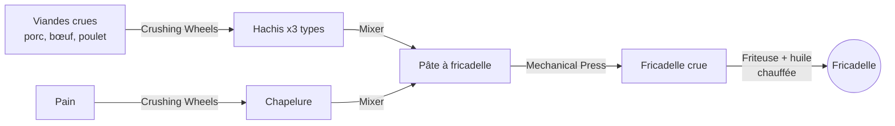
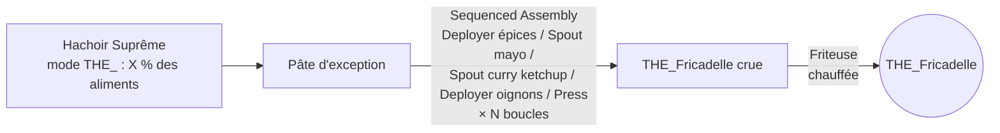

# 01 — Vision & gameplay

## Pitch

Une friterie industrielle dans Create. Le joueur hache des viandes, mélange une pâte, la met en forme et la plonge dans l'huile bouillante. Plus le palier est haut, plus il faut industrialiser : THE_FRICADELLE demande de faire passer **chaque aliment existant dans le modpack** par une seule machine.

Ton : humour belge assumé (noms, tooltips, sons, messages), mais mécaniques sérieuses et équilibrées pour un serveur.

## Principes de design

1. **100 % Create-natif** quand c'est possible : Crushing Wheels, Millstone, Mixer (chauffé ou non), Mechanical Press, Spout, Deployer, Sequenced Assembly, Blaze Burner. On n'ajoute que 2 machines : la **Friteuse** et le **Hachoir Suprême**.
2. **Automatisable de bout en bout.** Aucune étape ne doit exiger un clic droit manuel obligatoire.
3. **S'adapte au modpack.** La liste d'aliments de THE_FRICADELLE est calculée au lancement, pas écrite en dur.
4. **Pensé pour Arcadia V2, mais autonome.** Compat JEI, Jade et KubeJS (voir `11-compat-arcadia.md`). Si Farmer's Delight est là, on utilise ses oignons/tomates/viandes via les tags `c:`. Sinon, des recettes de secours s'activent.
5. **Rien de bloquant pour un serveur** : pas de tick lourd, pas de scan du registre en boucle, données synchronisées proprement.

## Les trois paliers

### Palier 1 — Fricadelle (classique)

« Juste mélanger quelques viandes ».



- Le bœuf broyé donne en bonus du **blanc de bœuf** (graisse) → fondu au Mixer chauffé → **huile de friture**. (Les vraies frites belges sont cuites au blanc de bœuf.)
- Alternative végétale pour l'huile : Compacting de graines.

### Palier 2 — THE_Fricadelle

« Demande plus de choses ». Deux exigences :

1. Une **Pâte d'exception**, produite par le Hachoir Suprême en mode *THE_* : il faut y avoir fait passer **un certain pourcentage** des aliments du modpack (⚠️ **taux À DÉFINIR ensemble**, configurable).
2. Une chaîne **Sequenced Assembly** « spéciale » : épices → mayonnaise → curry ketchup → oignons → presse, en boucles.



### Palier 3 — THE_FRICADELLE

« Demande toutes les ressources alimentaires ».

```mermaid
flowchart LR
  ALL[Chaque aliment unique du modpack<br/>vanilla + FD et ses addons + Create: Food + ... (Arcadia V2)] -->|tapis / funnels| HS[Hachoir Suprême<br/>mode ULTIME : 100 %]
  HS --> PA[Pâte absolue]
  PA & T2[THE_Fricadelle] -->|Mixer<br/>super-chauffé| RU[THE_FRICADELLE crue]
  RU -->|Friteuse<br/>super-chauffée| U((THE_FRICADELLE))
```

- « Aliment » = tout item qui possède le data component `minecraft:food`, **plus** un tag d'ajouts manuels (ex. le gâteau, qui se mange mais n'est pas un item-nourriture), **moins** une blacklist (nos propres fricadelles, items créatifs uniquement, etc.). Détails : `03-architecture.md` § FoodIndex.
- Chaque aliment compte **une seule fois** (par ID d'item). Le Hachoir refuse les doublons pour ne pas gaspiller.

## Ce qu'on obtient en mangeant

Faim/saturation croissantes, effets de potion, gags (sons, particules, message), advancements. **Toutes les valeurs sont ⚠️ À DÉFINIR ensemble** — voir `08-decisions-ouvertes.md`. En attendant, le code utilise des valeurs provisoires centralisées dans une seule classe (`BSFoods`) pour être faciles à changer.

## Hors périmètre v1 (idées pour plus tard)

- Frites, mitraillette, sauce andalouse/samouraï, cornet de frites.
- Huile usagée qui se dégrade et doit être filtrée.
- Friterie décorative (comptoir, enseigne, néons).
- Compat KubeJS / CraftTweaker pour ajouter des recettes de friture.
